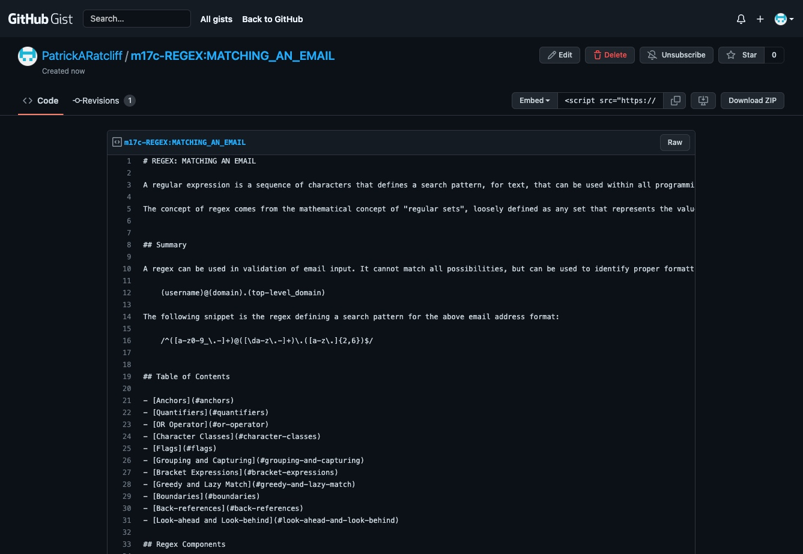

# m17c-regex
# 
# Date: 23/10/2022, 4:53:49 pm
  
# Patrick Ratcliff
# GitHub Username: PatrickARatcliff
# GitHub Repo URL: https://github.com/PatrickARatcliff/m17c-regex
# GitHubGist URL: https://gist.github.com/PatrickARatcliff/6d3c086286199e32c18a73eacb0dfa8e

## Table of Contents
- [Project Description](#project-description)
- [Installation Instructions](#installation-instructions)
- [Usage Information](#usage-information)
- [Contribution Guidelines](#contribution-guidelines)
- [Test Instructions](#test-instructions)
- [License](#license)
  
## Project Description
- A tutorial that breaks-down the regex for an email address: /^([a-z0-9_\.-]+)@([\da-z\.-]+)\.([a-z\.]{2,6})$/. The tutorial  defines and applies relevant regular expression components to this regex. The tuitorial also expands to address additional components which do not appearin the regex. This tutorial will be deployed as gist.
  
## Installation Instructions
- N/A
  
## Usage Information
- To use simply read the tutorial and apply your new-found knowledge!
  
## Contribution Guidelines
- To contribute to this project, fork the repository at ‘https://github.com/PatrickARatcliff/m17c-regex',create a pull request with a description for the change and its location.
  
## Test Instructions
- N/A
    
## License
- MIT License
- m17c-regex: As a web development student I want to create a tutorial for a rgular expression defining a search pattern for an email address. .
- Copyright (c) [2022] [Patrick ratcliff]. All rights reserved.

    

      Permission is hereby granted, free of charge, to any person obtaining a copy
      of this software and associated documentation files (the "Software"), to deal
      in the Software without restriction, including without limitation the rights
      to use, copy, modify, merge, publish, distribute, sublicense, and/or sell
      copies of the Software, and to permit persons to whom the Software is
      furnished to do so, subject to the following conditions:

      The above copyright notice and this permission notice shall be included in all
      copies or substantial portions of the Software.

      THE SOFTWARE IS PROVIDED "AS IS", WITHOUT WARRANTY OF ANY KIND, EXPRESS OR
      IMPLIED, INCLUDING BUT NOT LIMITED TO THE WARRANTIES OF MERCHANTABILITY,
      FITNESS FOR A PARTICULAR PURPOSE AND NONINFRINGEMENT. IN NO EVENT SHALL THE
      AUTHORS OR COPYRIGHT HOLDERS BE LIABLE FOR ANY CLAIM, DAMAGES OR OTHER
      LIABILITY, WHETHER IN AN ACTION OF CONTRACT, TORT OR OTHERWISE, ARISING FROM,
      OUT OF OR IN CONNECTION WITH THE SOFTWARE OR THE USE OR OTHER DEALINGS IN THE
      SOFTWARE.

    
***[This is an external link to the MIT license](https://en.wikipedia.org/wiki/MIT_License)***
  
---
